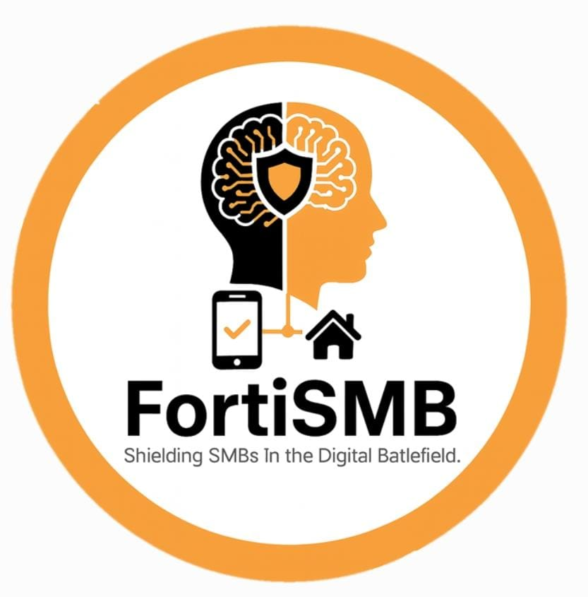
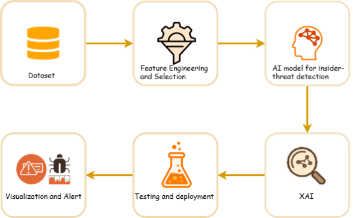
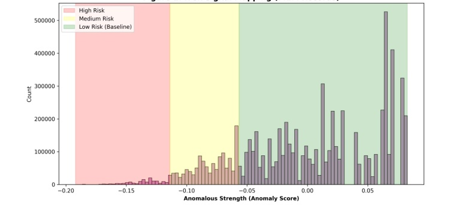
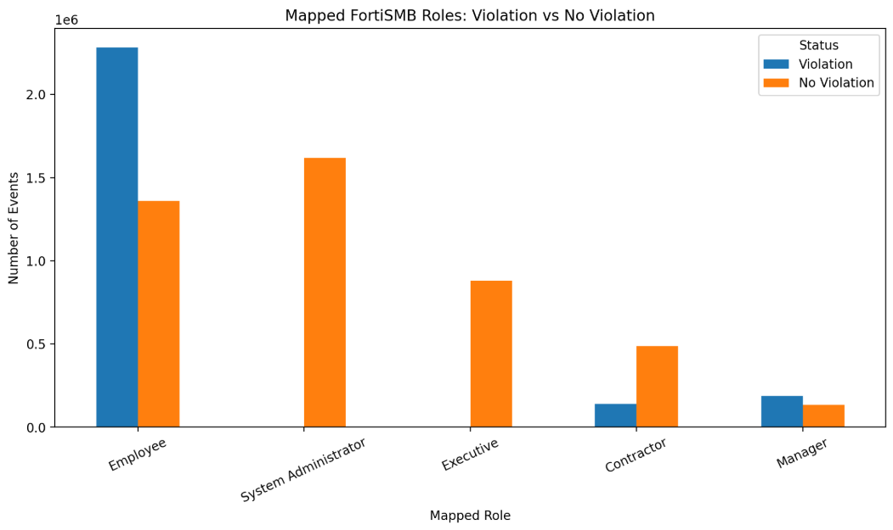
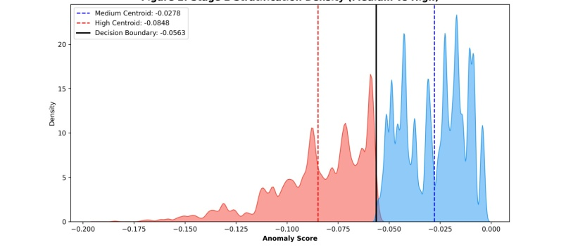
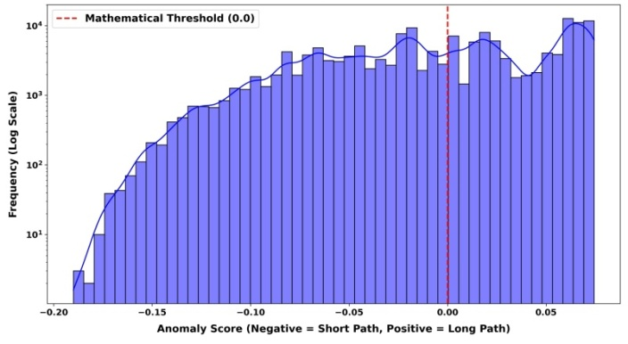
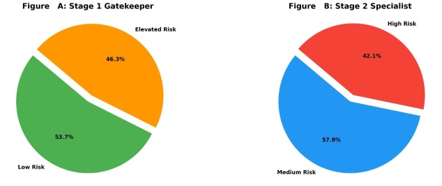

<p align="center">
  
</p>

<h1 align="center">FortiSMB</h1>
<p align="center">
  Explainable AI Framework for Insider Threat Detection in SMB Environments
</p>

<p align="center">
  
  
  
  
</p>

---

## Overview

FortiSMB is an AI-driven cybersecurity framework designed to detect insider threats in Small and Medium Business environments. It combines anomaly detection, role-based access control, and explainable AI to identify suspicious behavior and generate interpretable alerts.

## Problem Statement

Traditional security systems often fail to detect insider threats because insider behavior can appear legitimate, labeled attack data is limited, and many AI systems do not provide transparent reasoning behind their decisions.

## Proposed Solution

FortiSMB introduces a hybrid framework that:

* detects anomalous behavior using machine learning
* validates suspicious actions through RBAC-based policy checks
* explains risk predictions using XAI techniques
* supports alert generation and security analysis

## Key Features

* Insider threat detection using anomaly detection
* Role-Based Access Control validation
* Explainable AI support
* Risk scoring and visualization
* Security-oriented analysis workflow

## System Architecture

<p align="center">
  
</p>

## Results and Visualizations

### Anomaly Score Distribution

<p align="center">
  
</p>

### RBAC Violations Analysis

<p align="center">
  
</p>

### Kernel Density Estimation

<p align="center">
  
</p>

### Path Length Formulation

<p align="center">
  
</p>

### Risk Distribution

<p align="center">
  
</p>

## Project Structure

```bash
FortiSMB/
├── assets/
│   ├── architecture.png
│   ├── anomaly_distribution.png
│   ├── rbac_violations.png
│   ├── kde_analysis.png
│   ├── path_length.png
│   ├── risk_distribution.png
│   └── logo.png
├── data/
├── src/
├── .gitignore
├── LICENSE
├── README.md
└── requirements.txt
```

## Installation

```bash
git clone https://github.com/Sarah-Mohamed166/FortiSMB.git
cd FortiSMB
pip install -r requirements.txt
```

## Usage

```bash
python src/main.py
```

## Dataset

This project uses the CERT Insider Threat Dataset.

## Author

Sara Walid Mohamed
